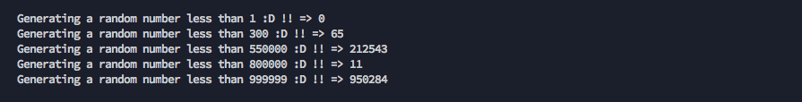
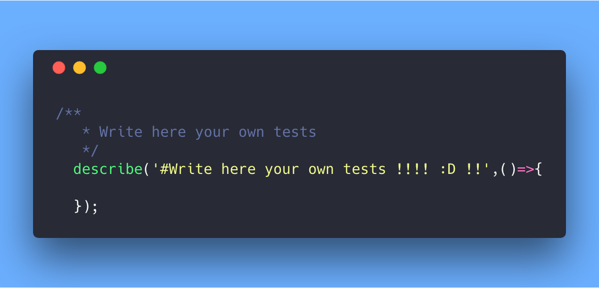
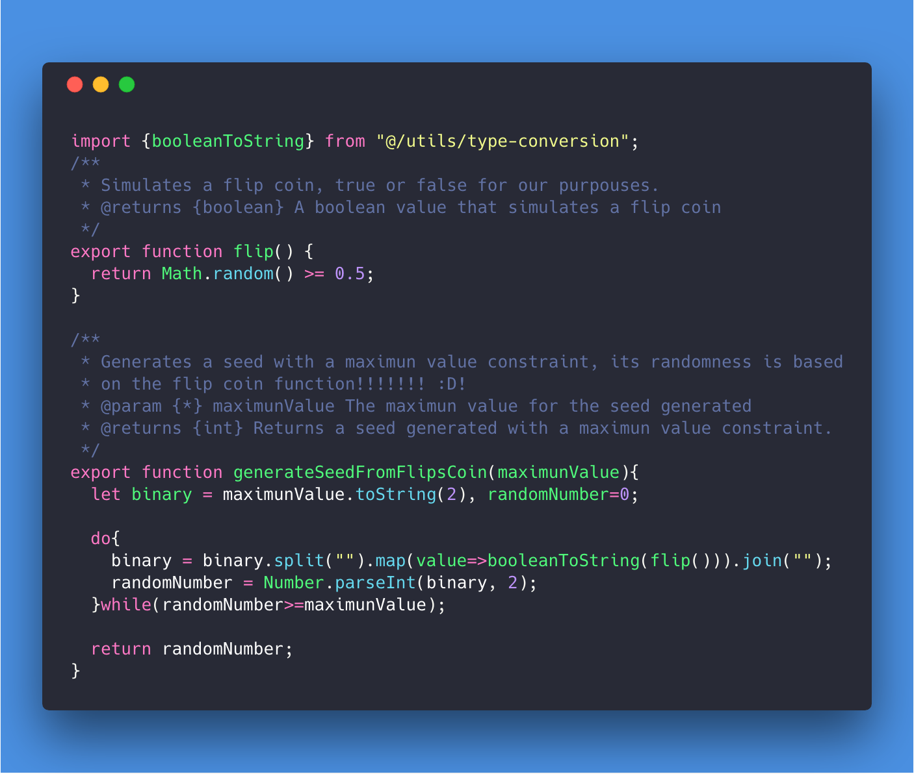
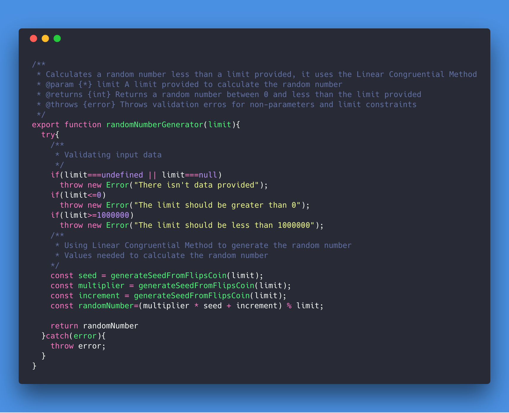

# RandomNumberGenerator

**A simple random number generator**  
_Implementing Linear Congruential Algorithms using coin flip!!!_




### Parameters

| Input | Type | Required |
| :---: | :---: | :---: |
| `limit` | Number | true |

**Constrains:**

+ It should be a value greater than 0
+ It should be a value greater than 1,000,000

## Project setup
```
npm install
```

### Compiles and execute tests
```
npm run test
```

### Compiles and hot-reloads for development and testing
```
npm run dev
```

### Please see the following video instructions to start the tests !!!

[](https://asciinema.org/a/195638)

## Write your own tests!!

Add your tests by editing the file located in the folder `test\random\number.test.js`, there is a section special made for you within this file:



you would find some examples there !!! :D!

### Notes:

+ The flip function is implemented and located in `src/utils/flip-coin.js`



Is implemented within the function `generateSeedFromFlipsCoin`

+ And the function `generateSeedFromFlipsCoin` is used within the main file `src/random/number.js` to generates the seeds needed to execute the **Linear Congruential Method**


